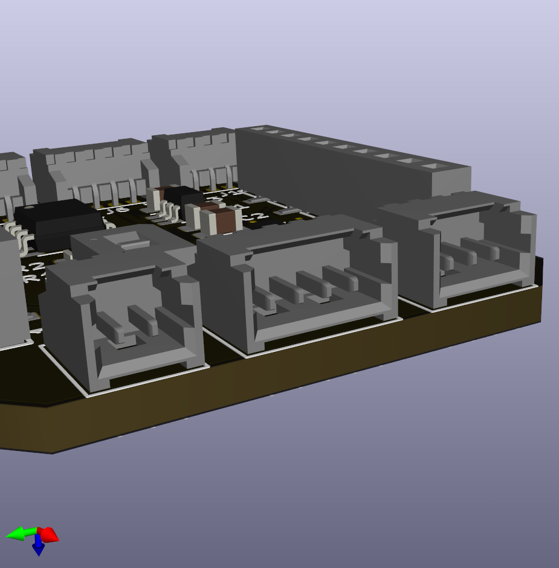
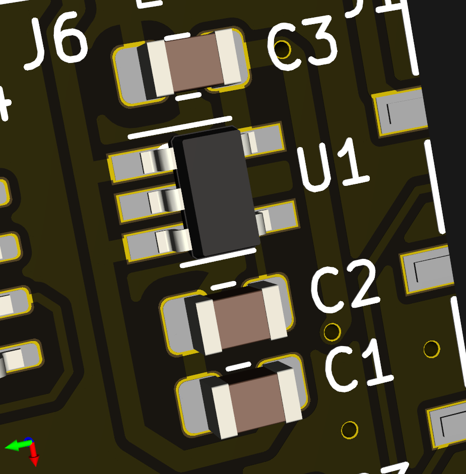
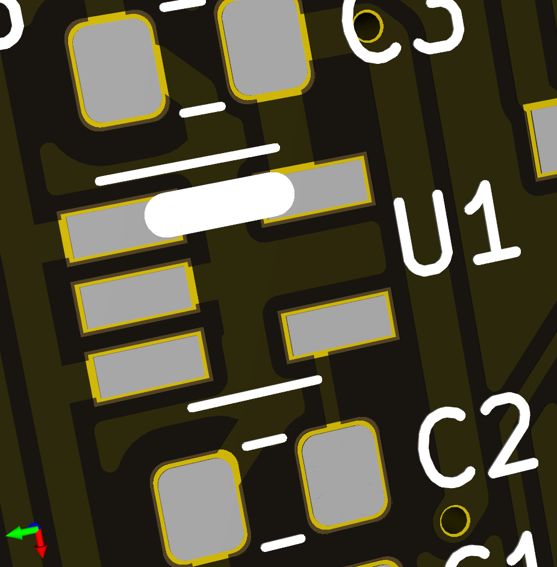
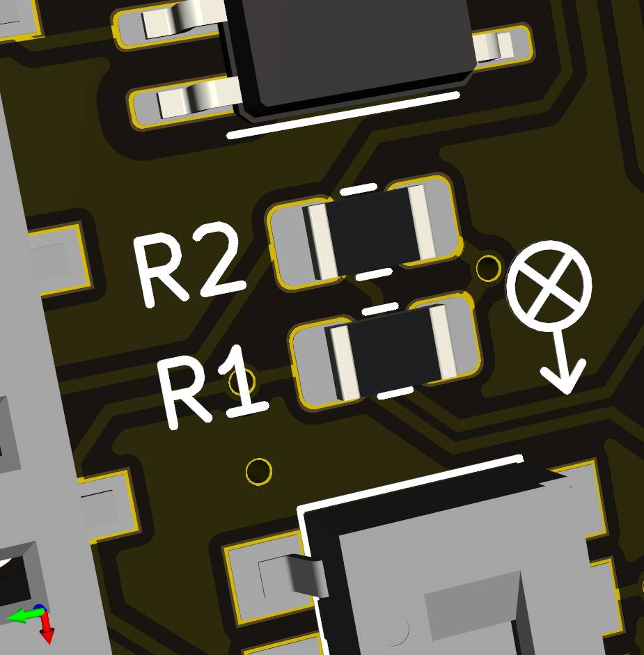
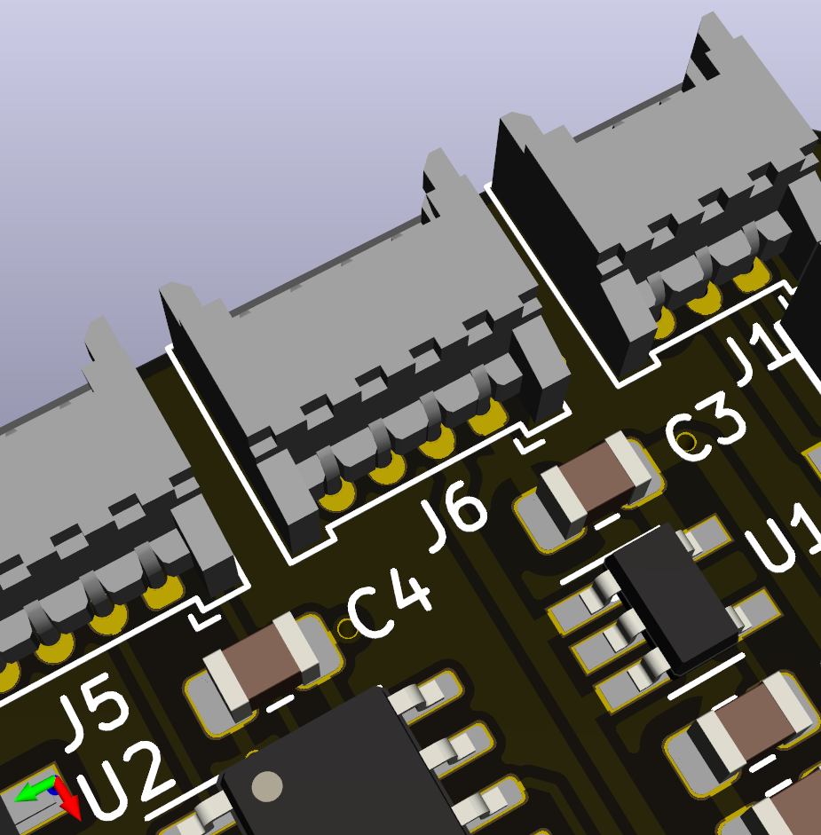

# Crazyflie 2 deck carrier
Rev 0.1A

This carrier board lets the Crazyflie 2 decks by [Bitcraze AB ](https://www.bitcraze.io/) be carried by other drones. The board functions similarly to a breakout board but with additional functions. The board is originally designed for the Eachine Trashcan, but may also be useful for other drones.

Nearly all of the features on this carrier board are optional, unused components can be left out to save weight and assembly time. Refer to the *optional features* section below to check which components should be installed for your application.

## Interface
The carrier board should be connected to an autopilot using the connectors `J1` to `J5`. The connectors are grouped by function. In nearly all cases the board can be connected directly to the corresponding autopilot pins.

PWR (`J1`):
- VCOM provides power to this board and the decks. VCOM does not need to be regulated.
- VUSB is a power supply *to* the drone, for instance using the Qi charging deck.

UART (`J2`):

SPI (`J3`):
- The IO pins on `J5` are typically used as Chip Select.

I2C (`J4`):

IO (`J5`):
- IO functionality can be replaced by the on-board I2C-to-GPIO and I2C-to-1-Wire bridges for controllers with few free pins.

AUX (`J6`):
- The auxiliary UART is connected directly to either UART1 or UART2.

## Bill of materials

## Ordering

## Assembly
Recommended soldering order:
1. Passives (C, R)
1. ICs (U)
1. Switch (SW)
1. Headers (P)
1. Connectors (J)

## Optional features
### Molex Picoblade connectors
Components: `J1` to `J6`

The PCB is designed for through-hole Molex Picoblade connectors. Unused connectors can be left out to save weight. Wires can also be soldered directly to the connector pads for permanent connections.

### Voltage regulator
Components: `U1`, `C1`, `C2`, `C3`

The carrier board includes a voltage regulator that supplies 3.0V at max 150mA. Input voltage VCOM can be ≤16V, **although compatibility with the crazyflie decks should be checked!**

For autopilots that already supply regulated 3.0V on VCOM, the voltage regulator can be replaced by a solder bridge between VCOM (pad 1) and VCC (pad 5) of `U1` (marked by white line).

### I2C Pull-ups
Components: `R1`, `R2`

The board has space for I2C pull-up resistors (0805) (`R1`, `R2`) if these are not present on the autopilot.

### I2C-to-GPIO
Components: `U2`, `C4`

For drones with a limited number of free pins, the I2C-to-GPIO bridge `U2` can be installed to drive the decks' IO pins. Since most of the IO pins serve as Chip Select for SPI communication, software drivers should take care that the I2C/GPIO operation is completed before SPI communication begins.

The IO inputs on the `IO` connector should not be used if the I2C-to-GPIO bridge is in use.

### I2C-to-1-Wire
Components: `U3`, `R3`, `C5`

For drones with a limited number of free pins, the I2C-to-1-Wire bridge `U3` can save another pin by routing 1-Wire data over the existing I2C lines. Note that most decks only use 1-Wire for identification and that not all autopilots support this feature. (Paparazzi, for instance, does not.)

The OW input on the `IO` connector should not be used if the I2C-to-1-Wire bridge is installed.

### Auxiliary connector
Components: `J6`, `SW1`

The AUX connector `J6` can be used to connect another board to the carrier deck. The AUX connector provides unregulated power (VCOM) and a UART bus. Using switch `SW1`, the auxiliary UART can be connected to UART1 or UART2, depending on the decks that are in use.

For permanent installations, switch `SW1` can be replaced by solder bridges between the relevant pads.

